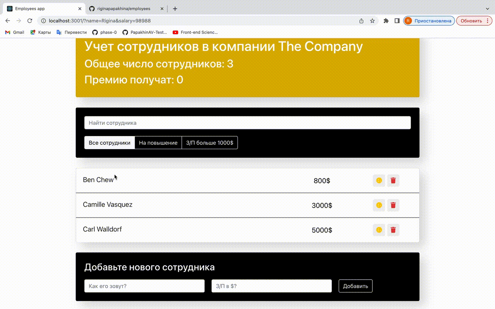
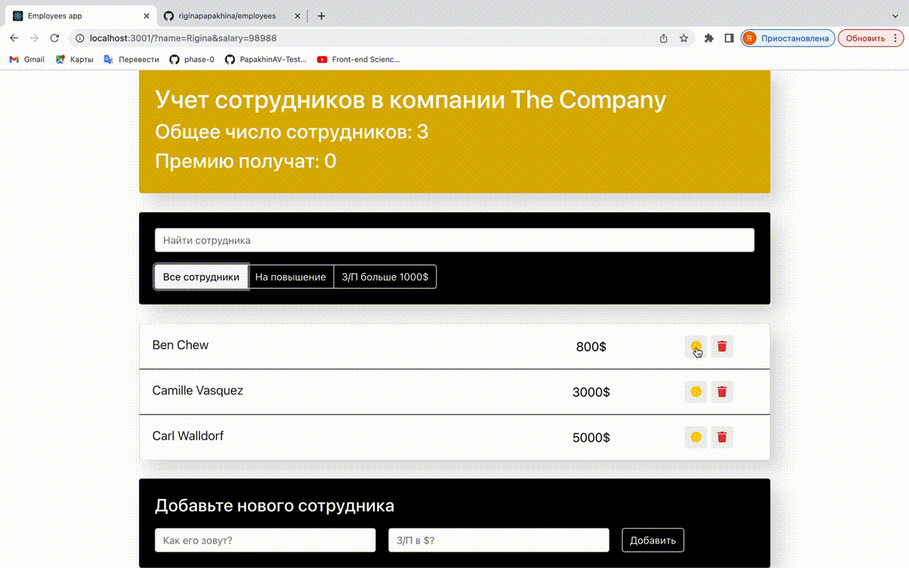
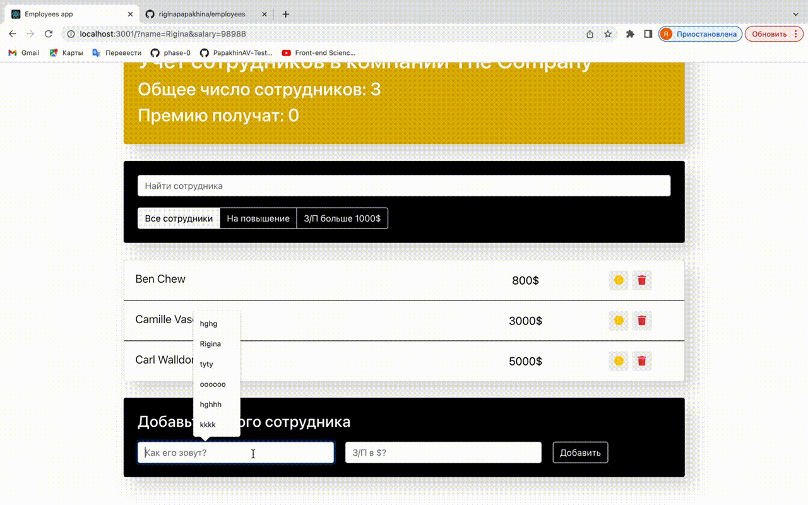

# Приложение по работе со списком сотрудников
## Данное приложение является вариацией To-Do List
## Стэк - React, JS, HTML, CSS
### Разработчик:
- [Ригина П.](https://github.com/riginapapakhina)

Приложение создано в рамках работы над заданиями курса Ивана Петриченко ["Полный курс по JavaScript + React - с нуля до результата"](https://www.udemy.com/course/javascript_full/)

### Приложение позволяет:
- Отобразить список сотрудников компании (динамически)
- Осуществить поиск в списке сотрудников
- Ввести данные о премировании, повышении или увольнении сотрудника
- Отфильтровать существующих сотрудников по категориям
- Добавить новых сотрудников
#
### `Динамическое отображение списка сотрудников. Выдача премии, повышение з/п, увольнение`

#
### `Поиск среди сотрудников`

#
### `Фильтровать сотрудников по категориям`
 

#
### `Добавить новых сотрудников`
 
ВАЖНО! Если пользователь указывает данные неверно,то данные не добавляются

